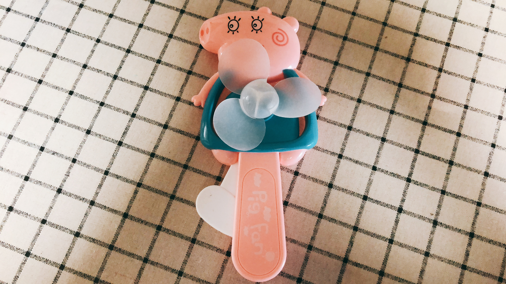

<html>
	<head>
		<title>六一义卖</title>
	</head>	
	<body>
		
		

			<strong style="font-size:25px">物品名称：小猪乔治电风扇</strong>
		

		

			<strong style="font-size:25px">物品主人：周浩然</strong>
		

		

			<strong style="font-size:25px">物品售价：2元</strong>
		

		

			<strong style="font-size:25px">物品来源：参加活动送的</strong>
		

		

			<strong style="font-size:25px">物品卖出原因：我不需要电风扇，因为有空调。</strong>
		

